# Pinball Machine Built from Scratch

## Whole CAD Assembly View
|                       Top view                        |                         Bottom View                         |                          Isometric view                           |
|:-----------------------------------------------------:|:-----------------------------------------------------------:|:-----------------------------------------------------------------:|
| 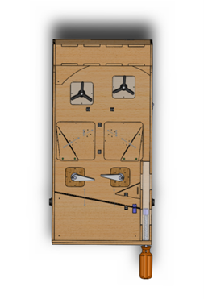 | 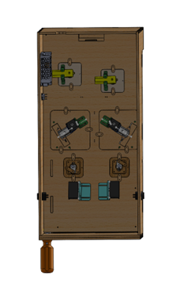 | 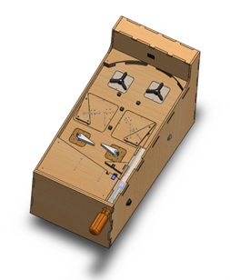 |

## Complete Physical Assembly
|                       Top view                       |                        Bottom View                         |                          Isometric view                          |
|:----------------------------------------------------:|:----------------------------------------------------------:|:----------------------------------------------------------------:|
| 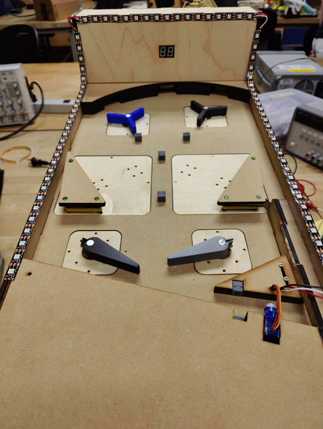 | 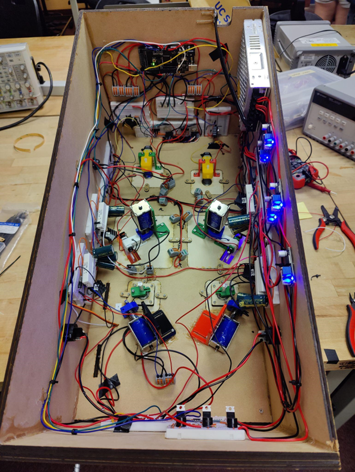 | 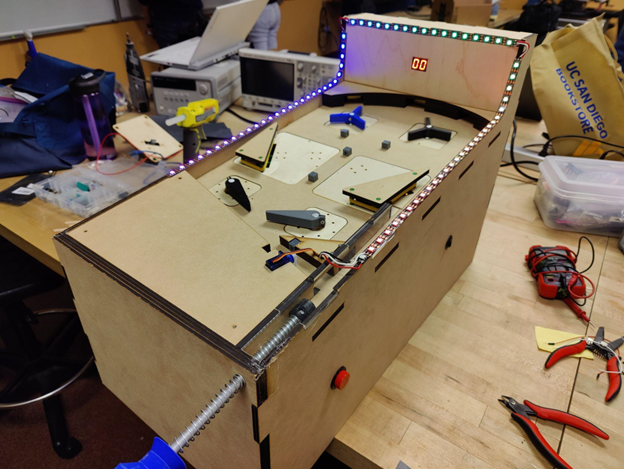 |

## Subsystem Level Design
### Plunger subsystem
|                    Block Diagram                     |   Circuit Diagram(sketches)    |
|:----------------------------------------------------:|:------------------------------:|
| 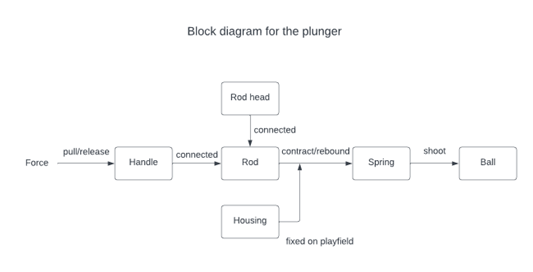 |    |
|                     CAD Picture                      |        Physical Picture        |
|                             |  |

### IR subsystem
|                  Block Diagram                  |                   Circuit Diagram                   |
|:-----------------------------------------------:|:---------------------------------------------------:|
| 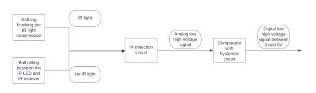 |  |
|                   CAD Picture                   |                  Physical Picture                   |
|                        |                       |

### Flipper subsystem
|                    Block Diagram                     |                     Circuit Diagram                      |
|:----------------------------------------------------:|:--------------------------------------------------------:|
| 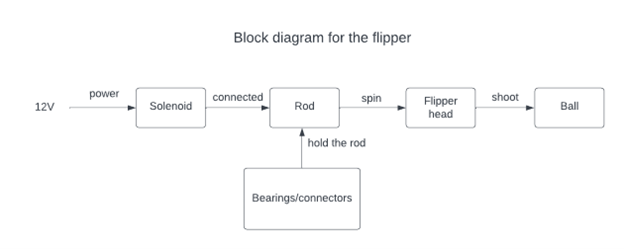 | 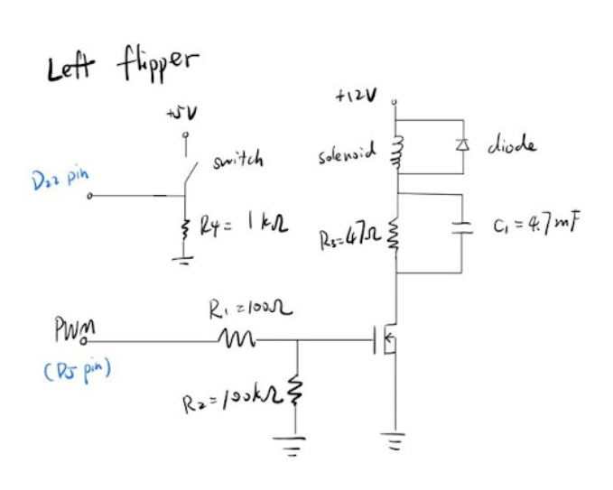 |
|                     CAD Picture                      |                     Physical Picture                     |
|                             |                            |

### Spinning wheel subsystem
|                        Block Diagram                        |                         Circuit Diagram                         |
|:-----------------------------------------------------------:|:---------------------------------------------------------------:|
| 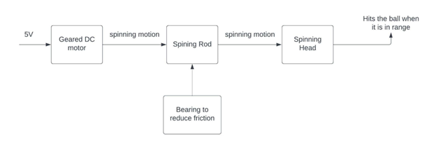 |  |
|                         CAD Picture                         |                        Physical Picture                         |
|                                    |                                   |

### Slingshot subsystem
|                     Block Diagram                      |                       Circuit Diagram                        |
|:------------------------------------------------------:|:------------------------------------------------------------:|
| 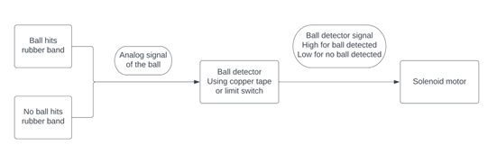 |  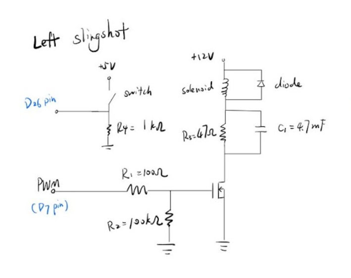  |
|                      CAD Picture                       |                       Physical Picture                       |
|   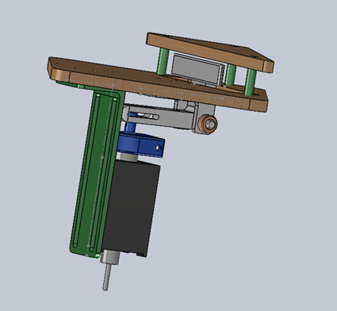   | 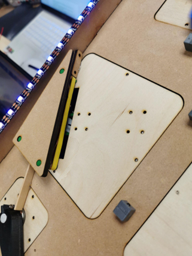 |
