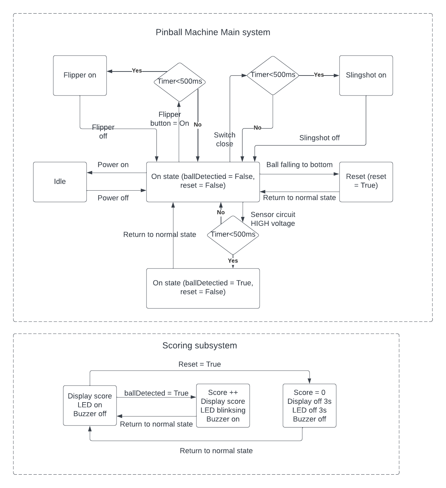
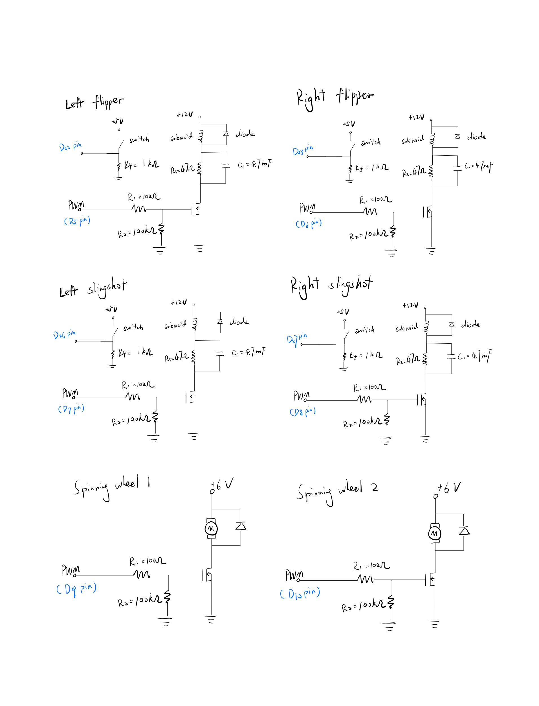
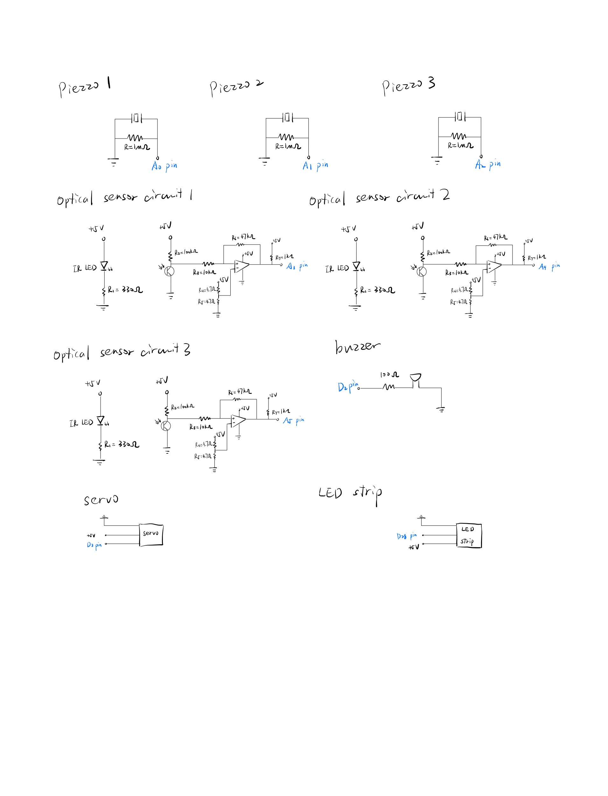
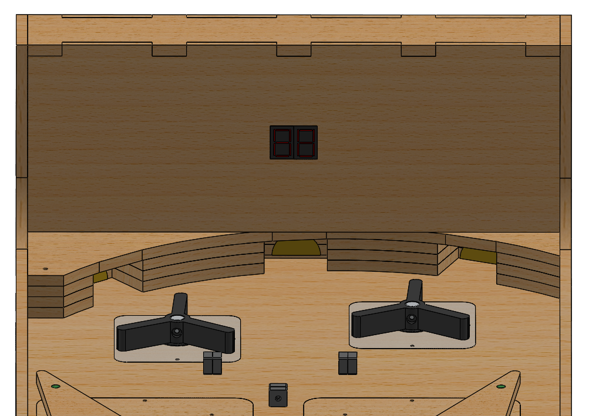
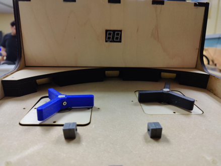
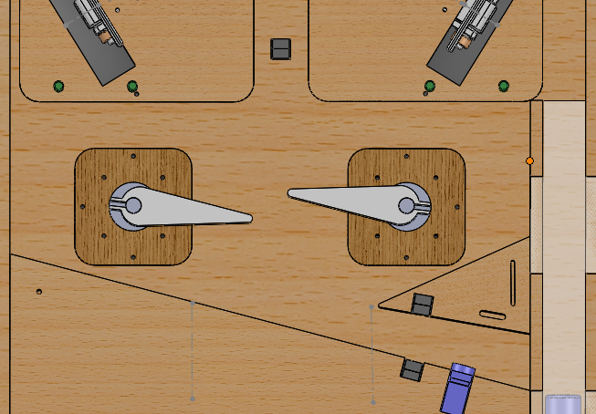
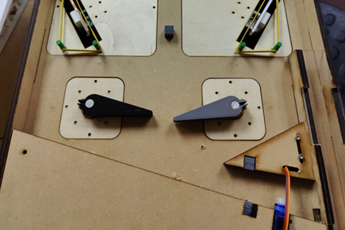
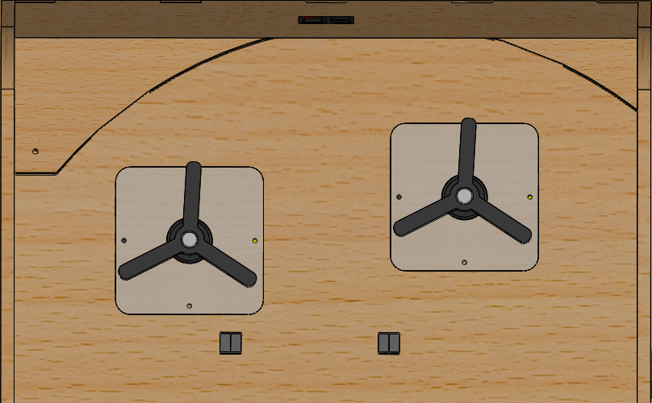

# Pinball Machine Built from Scratch

<!-- PROJECT LOGO -->
 

  
  <h3 align="center">Pinball Machine Build from Scratch </h3>   
  

    Haozhang Chu, Yichen Yang  
  

<!-- TABLE OF CONTENTS -->

  
<h2><b>Abstract</b><h2>

    <li><a href="#finite-state-machine-design">Finite State Machine (FSM) Design</a></li>
    <li><a href="#whole-cad-assembly-view">Whole CAD Assembly View</a></li>
    <li><a href="#circuit-design">Circuit Design</a></li>
    <li><a href="#complete-physical-assembly">Complete Physical Assembly</a></li>
    <li>
      <a href="#subsystem-level-design">Subsystem Level Design</a>
      <ul>
        <li><a href="#ir-subsystem">IR subsystem</a></li>
        <li><a href="#flipper-subsystem">Flipper subsystem</a></li>
        <li><a href="#spinning-wheel-subsystem">Spinning wheel subsystem</a></li>
        <li><a href="#slingshot-subsystem">Slingshot subsystem</a></li>
      </ul>
    </li>

## Finite State Machine Design

## Whole CAD Assembly View
|                       Top view                        |                         Bottom View                         |                          Isometric view                           |
|:-----------------------------------------------------:|:-----------------------------------------------------------:|:-----------------------------------------------------------------:|
|  |  |  |

## Circuit Design
|                                              |                                                  |
|-----------------------------------------------------|-----------------------------------------------------------|
|  |  |

## Complete Physical Assembly
|                       Top view                       |                        Bottom View                         |                          Isometric view                          |
|:----------------------------------------------------:|:----------------------------------------------------------:|:----------------------------------------------------------------:|
|  |  |  |

## Subsystem Level Design

### IR subsystem
|                  Block Diagram                  |                    Circuit Diagram                    |
|:-----------------------------------------------:|:-----------------------------------------------------:|
|  |    |
|                   CAD Picture                   |                   Physical Picture                    |
|      |  |

### Flipper subsystem
|                    Block Diagram                     |                      Circuit Diagram                       |
|:----------------------------------------------------:|:----------------------------------------------------------:|
|  |    |
|                     CAD Picture                      |                      Physical Picture                      |
|      |  |

### Spinning wheel subsystem
|                        Block Diagram                        |                          Circuit Diagram                          |
|:-----------------------------------------------------------:|:-----------------------------------------------------------------:|
|  |    |
|                         CAD Picture                         |                         Physical Picture                          |
|      |  |

### Slingshot subsystem
|                     Block Diagram                      |                       Circuit Diagram                        |
|:------------------------------------------------------:|:------------------------------------------------------------:|
|  |    |
|                      CAD Picture                       |                       Physical Picture                       |
|      |  |
