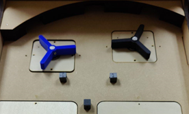

# Pinball Machine Built from Scratch

<!-- PROJECT LOGO -->
 

  
    
  

    Pinball Machine Build from Scratch 
    Collaborators: Haozhang Chu, Yichen Yang  
  

## Whole CAD Assembly View
|                       Top view                        |                         Bottom View                         |                          Isometric view                           |
|:-----------------------------------------------------:|:-----------------------------------------------------------:|:-----------------------------------------------------------------:|
|  |  |  |

## Complete Physical Assembly
|                       Top view                       |                        Bottom View                         |                          Isometric view                          |
|:----------------------------------------------------:|:----------------------------------------------------------:|:----------------------------------------------------------------:|
|  |  |  |

## Subsystem Level Design

### IR subsystem
|                  Block Diagram                  |                    Circuit Diagram                    |
|:-----------------------------------------------:|:-----------------------------------------------------:|
|  |    |
|                   CAD Picture                   |                   Physical Picture                    |
|      |  |

### Flipper subsystem
|                    Block Diagram                     |                      Circuit Diagram                       |
|:----------------------------------------------------:|:----------------------------------------------------------:|
|  |    |
|                     CAD Picture                      |                      Physical Picture                      |
|      |  |

### Spinning wheel subsystem
|                        Block Diagram                        |                          Circuit Diagram                          |
|:-----------------------------------------------------------:|:-----------------------------------------------------------------:|
|  |    |
|                         CAD Picture                         |                         Physical Picture                          |
|      |  |

### Slingshot subsystem
|                     Block Diagram                      |                       Circuit Diagram                        |
|:------------------------------------------------------:|:------------------------------------------------------------:|
|  |    |
|                      CAD Picture                       |                       Physical Picture                       |
|      |  |
